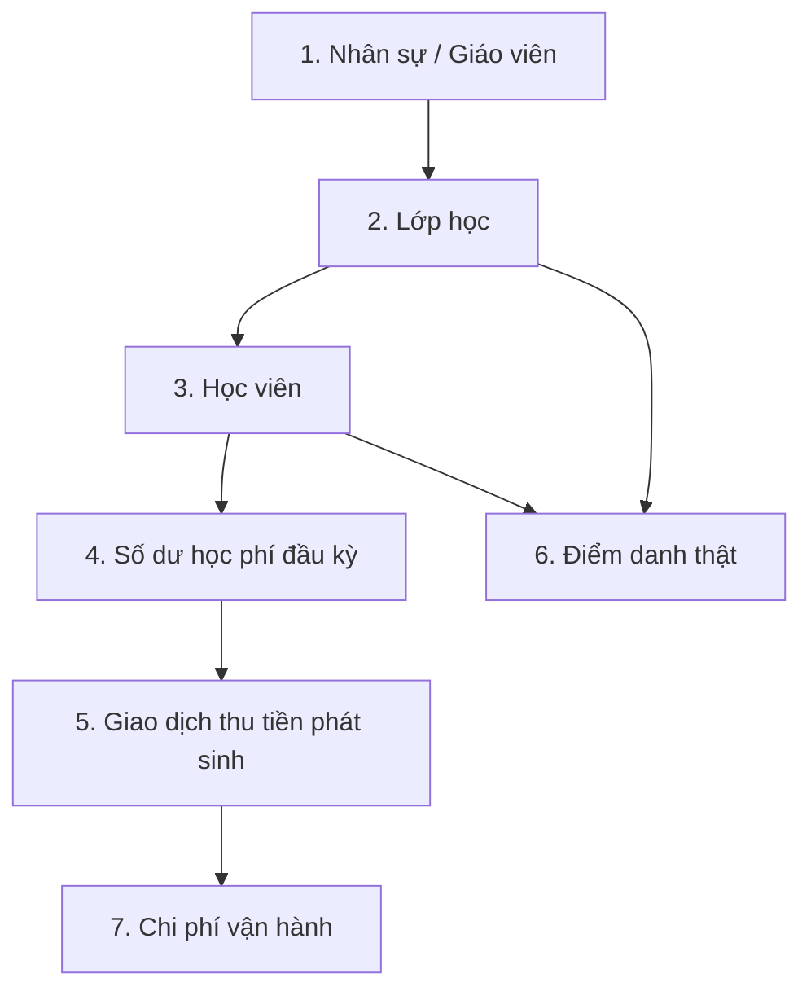

# Hướng dẫn Nhập dữ liệu từ Excel (DATA-01 Guide)

Tài liệu này hướng dẫn chi tiết Kế toán và Quản trị viên cách chuẩn bị file Excel mẫu, quy trình chạy xác thực kiểm tra (dry-run) và thực thi import dữ liệu thật vào hệ thống Kim Academy một cách an toàn.

---

## 1. Trình tự Import bắt buộc

Để tránh lỗi vi phạm ràng buộc liên kết khóa ngoại (ví dụ: gán học viên vào lớp chưa tồn tại, hoặc điểm danh học viên chưa được khai báo), bạn **bắt buộc** phải import các file dữ liệu theo đúng thứ tự sau:



1. **Nhân sự / Giáo viên (`staff`):** Cần có ID giáo viên để liên kết vào Lớp học.
2. **Lớp học (`classes`):** Cần có Lớp học trước để xếp Học viên vào lớp.
3. **Học viên (`students`):** Lưu trữ thông tin cá nhân và lớp học của học viên.
4. **Số dư học phí ban đầu (`tuition_balances`):** Khởi tạo tài chính đầu kỳ cho học viên (Số tiền đóng cũ, Số buổi đã học cũ).
5. **Giao dịch thu tiền phát sinh (`transactions`):** Các khoản thu học phí/sách/đồng phục thực tế phát sinh sau ngày vận hành.
6. **Điểm danh thật (`attendance`):** Điểm danh thực tế các ca học sau ngày vận hành.
7. **Chi phí (`expenses`):** Các khoản chi tiêu vận hành của trung tâm.

---

## 2. Chuẩn bị File mẫu Excel

Hệ thống cung cấp sẵn script tự động tạo 7 tệp template Excel chuẩn hóa. Hãy chạy lệnh sau trên terminal để tạo các file mẫu:

```bash
npm run generate-templates
```

Các tệp mẫu sẽ được lưu tại thư mục: `data-templates/`
Mỗi tệp mẫu chứa 3 sheet:
- **`HuongDan`:** Giải thích ý nghĩa của từng cột, định dạng bắt buộc, và trình tự import.
- **`DuLieuMau`:** Dòng tiêu đề cột (Header) bằng tiếng Việt và 2-3 dòng mẫu. **Bạn sẽ nhập dữ liệu thật của mình vào sheet này.**
- **`QuyTac`:** Các lỗi chặn (blocking) và cảnh báo (warning) tương ứng của tệp.

### ⚠️ Quy tắc định dạng chung:
- **Định dạng Ngày:** Bắt buộc nhập dạng `DD/MM/YYYY` (ví dụ: `25/06/2026`).
- **Định dạng Số (Tiền, Số buổi, Năm sinh):** Nhập số nguyên thuần túy, không có ký tự dấu phân cách nghìn hay ký tự chữ (ví dụ: nhập `1000000` thay vì `1.000.000đ`).
- **Phạm vi hệ thống:** Chỉ nhập lớp học/giao dịch offline (không có lớp online/học phí online).

---

## 3. Cách chạy Lệnh Import chi tiết

Tiến trình import được thiết kế chạy qua command-line (CLI) với hai bước an toàn: **Dry-run (Xác thực thử)** và **Confirm (Ghi thật)**.

### Bước 1: Dọn dẹp dữ liệu demo và Import Nhân sự (Chỉ chạy 1 lần duy nhất)
Trước khi đưa hệ thống vào chạy thật, cần xóa sạch toàn bộ dữ liệu demo thử nghiệm cũ. Sử dụng cờ `--reset-business-data` (script sẽ tự động tạo backup trước khi xóa, dọn sạch dữ liệu cũ nhưng **giữ nguyên tài khoản người dùng đăng nhập** của bạn):

```bash
npm run import:data -- --type staff --file data-templates/template_nhan_su.xlsx --reset-business-data --confirm
```
*(Thay thế đường dẫn file bằng file dữ liệu thật của bạn)*

### Bước 2: Import các file tiếp theo ở chế độ thêm mới (Append)
Đối với các file dữ liệu tiếp theo, sử dụng chế độ mặc định `--mode append` (chỉ thêm mới dữ liệu, không xóa dữ liệu đang có):

```bash
# 2. Import Lớp học
npm run import:data -- --type classes --file real-data/lop_hoc.xlsx --mode append --confirm

# 3. Import Học viên
npm run import:data -- --type students --file real-data/hoc_vien.xlsx --mode append --confirm

# 4. Import Số dư học phí ban đầu (Chốt dư đầu kỳ)
npm run import:data -- --type tuition_balances --file real-data/so_du_dau_ky.xlsx --mode append --confirm

# 5. Import các giao dịch phát sinh
npm run import:data -- --type transactions --file real-data/giao_dich.xlsx --mode append --confirm

# 6. Import điểm danh phát sinh
npm run import:data -- --type attendance --file real-data/diem_danh.xlsx --mode append --confirm

# 7. Import chi phí phát sinh
npm run import:data -- --type expenses --file real-data/chi_phi.xlsx --mode append --confirm
```

---

## 4. Giải thích nghiệp vụ chốt Số dư Học phí Đầu kỳ

Do hệ thống Kim Academy tính toán động toàn bộ quỹ học phí còn lại và số buổi còn lại từ lịch sử Giao dịch và Điểm danh, dữ liệu số dư từ tệp `template_so_du_hoc_phi_ban_dau.xlsx` sẽ được script xử lý tự động quy đổi như sau:

1. **Ngày chốt số dư (`openingBalanceDate`):** Là ngày chốt số liệu cũ trước khi bắt đầu dùng app (ví dụ: ngày `01/06/2026`).
2. **Số tiền đã đóng trước đó (`tuitionPaidBefore`):** Quy đổi thành 1 giao dịch thu `Học phí offline` tại ngày `openingBalanceDate`, gắn nhãn nguồn `source: 'opening_balance_import'`.
3. **Số buổi đã học trước đó (`sessionsAttendedBefore`):** Quy đổi thành các buổi điểm danh ảo (`present`) có ngày học lùi dần liên tục về trước ngày `openingBalanceDate`, gắn nhãn nguồn `source: 'opening_balance_import'`.
4. **Xác thực chênh lệch (Dung sai):**
   - Công thức kiểm tra chéo: `expectedRemaining = (tuitionPaidBefore / feePerSession) - sessionsAttendedBefore`.
   - Nếu chênh lệch giữa công thức tính toán và số buổi còn lại thực tế nhập vào (`remainingSessions`) lớn hơn **0.5 buổi**: Bạn **bắt buộc** phải nhập lý do giải trình tại cột `note` (ví dụ: "Khuyến mãi 1 buổi", "Giảm giá học phí"). Nếu để trống cột `note`, hệ thống sẽ báo **lỗi chặn (blocking)** và từ chối nhập để tránh sai lệch tài chính.

---

## 5. Quy tắc phòng ngừa rủi ro dữ liệu

### 🚫 Trùng lặp học viên:
Hệ thống **chặn hoàn toàn (blocking)** việc ghi đè hoặc tự động merge thông tin học viên để đảm bảo an toàn dữ liệu:
- Chặn nếu trùng mã `studentId` hoặc trùng `parentPhone` (Số điện thoại phụ huynh) hoặc trùng cả Tên + SĐT phụ huynh với học viên đã có sẵn.
- Nếu trùng Tên nhưng khác Số điện thoại: Hệ thống chỉ đưa ra Warning cảnh báo và vẫn cho phép thêm mới (xem như 2 học viên khác nhau trùng tên).

### 🛡️ Cơ chế sao lưu tự động:
- Mỗi lần bạn chạy lệnh ghi thật (`--confirm`), hệ thống luôn tự động tạo 1 file backup tại thư mục `data/backups/`.
- Nếu quá trình import bị lỗi, bạn hãy tham khảo tài liệu [docs/DATA-01_BACKUP_RESTORE.md](file:///c:/Users/Home/.gemini/antigravity-ide/scratch/QLTrungtam/docs/DATA-01_BACKUP_RESTORE.md) để thực hiện khôi phục dữ liệu thủ công chỉ trong 3 phút.

### 📓 Nhật ký Batch Log:
- Lịch sử tất cả các đợt import (thành công/thất bại, số dòng hợp lệ, đường dẫn tệp backup) đều được lưu trữ tại `data/import_batches.json` để phục vụ công tác đối soát dữ liệu sau này.
- Bạn có thể truyền thêm cờ `--session-id <tên_đợt_import>` (ví dụ: `--session-id dot_chuyen_doi_6_2026`) để gom nhóm các file import trong cùng một phiên làm việc.
